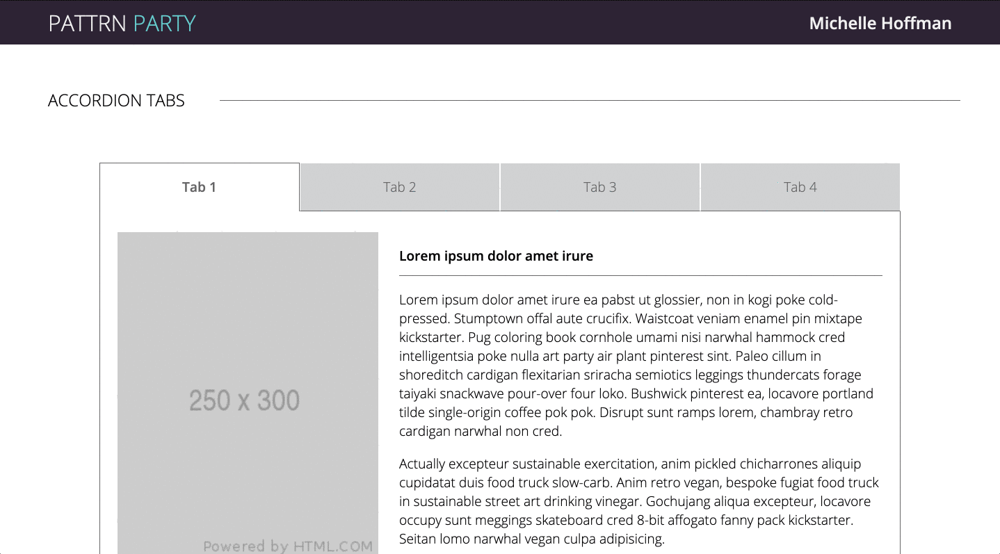
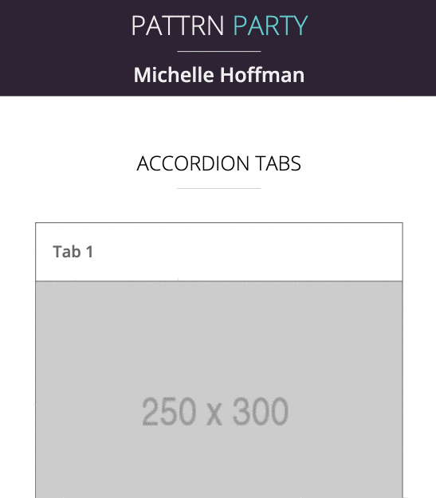

### Pattrn Party
Module 4 project | Turing School of Software & Design

---

#### Summary
This assignment was an exercise in building 3 common UI design patterns. These were some of the more complex UI elements that I had the opportunity to create during the Turing program. 

##### Large Screens

##### Small Screens

##### [View Pattrn Party](https://michellehoffman.github.io/pattrn-party/)

#### Personal Challenges
My personal challenge was organizing the HTML in a way that would work well for both small and large screens. Over the course of the project, I learned to think about responsiveness from the very beginning of writing HTML for a project. This is a skill that I have utilized with every project since and it has saved me a lot of time when working toward making applications responsive.
